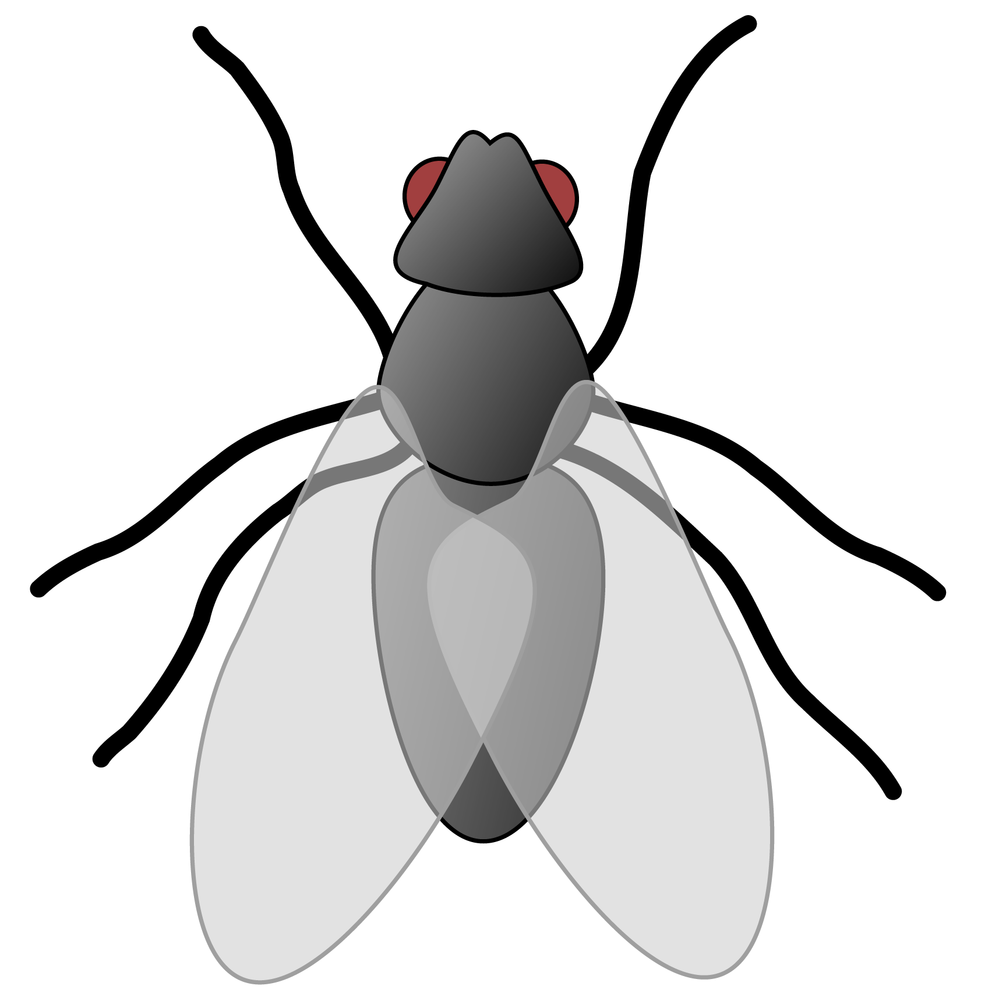

# FlyCAGE 

> __Retrieving biological insights by comparing gene mRNA expression profiles.__

FlyCAGE is a tool that uses the correlation coefficient between gene expression profiles to retrieve insights about gene similarity. 

Visit [flycage.herokuapp.com](flycage.herokuapp.com) to try out our tool.

## Tool Description
### Problem
Common transcriptomic analysis methods such as differential gene expression analysis and agglomertive gene clustering are excellent ways to analyze transcriptomic data. However, the analysis from these methods are limited to the data retrieved from the experiment. FlyCAGE aims to utilize the "big-data" available in public repositories to provide better analysis of experimental data.

### Solution
FlyCAGE is a web-accessible application that conducts integrative analysis of *Drosophila melanogaster* mRNA expression data to discover genes with correlated spatiotemporal expression. We would predict that genes showing this correlation may be co-regulated or share similar biological functions. FlyCAGE therefore allows us to identify candidate genes involved in a given process, to discover regulatory interactions in genetic networks, and to verify the quality of gene clustering techniques.

### Value
Due to its cost-effectiveness, many genetics labs will retrieve the gene expression profiles to understand more about the underlying experiment. This retrieval is done through RNA-seq or microarrays. There are several simple ways to analyze gene expression data (DESeq, GSEA, etc.). We hope that FlyCAGE will be another tool that scientists will use to easily retrive insights about their experimental data.

### Roadmap
Interested in the next steps of FlyCAGE? View the [ROADMAP.md](ROADMAP.md)

## Contribution
### What do we need?
Specifically, we are looking for the following:
 * Front-end developers (HTML, CSS, JS, Bootstrap, and jQuery) (biology knowledge not required)
 * Back-end developers (Java, Spring MVC, Thymeleaf) (biology knowledge not required)
 * Bioinformaticians with a strong knowledge of transcriptomics to help with data analysis and ideation
 * Biologists in any discipline of life sciences that may help with ideation
 
Although, any sort of help on the project would be much appreciated!

If you are interested in contributing, please see the [CONTRIBUTING.MD](https://github.com/CodingBash/FlyCAGE) for more information!

### Code of conduct
This project adheres to the Contributor Covenant [code of conduct](CODE_OF_CONDUCT.md). By participating, you are expected to uphold this code. 

### Development Setup
More information on the workstation setup will be added at a later time.

### Contact Us
For any questions about the project, please contact the main developer at [bbecer2@ilstu.edu](mailto:bbecer2@ilstu.edu)

